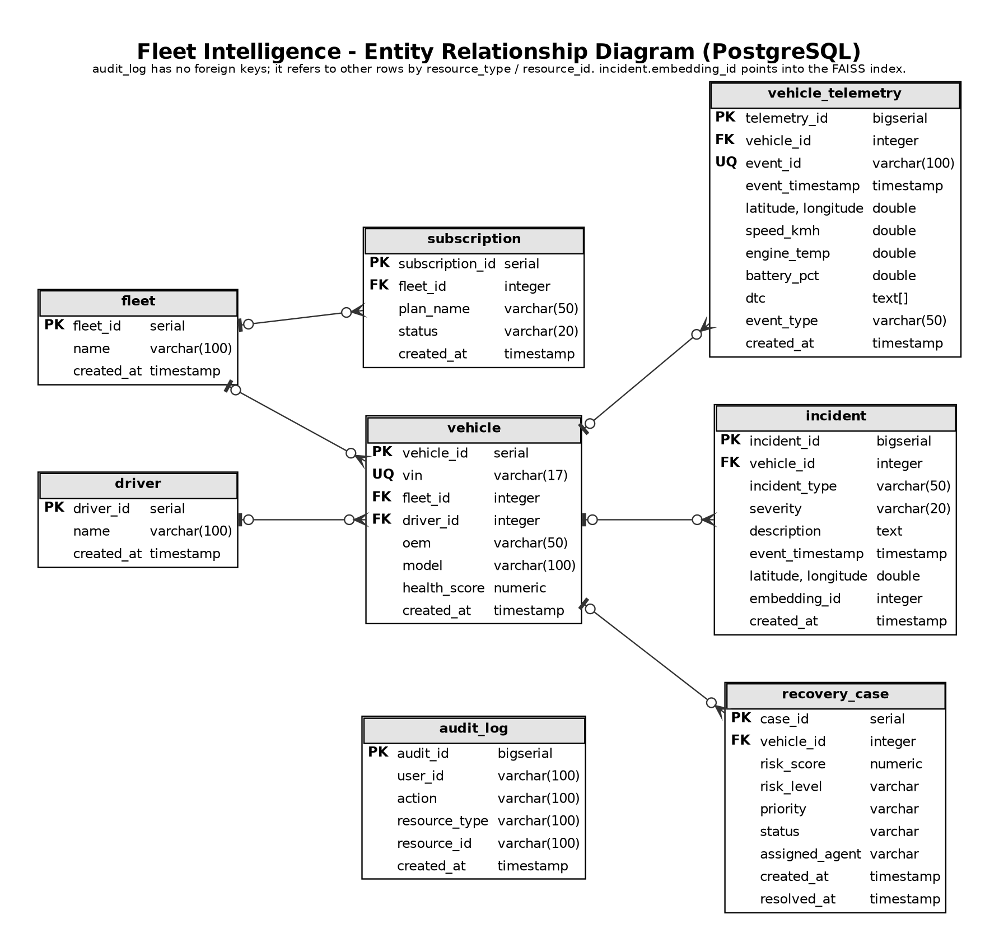

# Fleet Intelligence — Entity Relationship Diagram

## PostgreSQL ER Diagram

The following diagram represents the relational PostgreSQL data model used by Fleet Intelligence.



### Main Relationships

- A `fleet` contains multiple `vehicle` records.
- A `fleet` can have multiple `subscription` records.
- A `driver` can be associated with vehicles.
- A `vehicle` generates multiple `vehicle_telemetry` records.
- A `vehicle` can have multiple `incident` records.
- A `vehicle` can have multiple `recovery_case` records.
- `audit_log` records system actions using resource references rather than direct foreign keys.
- `incident.embedding_id` refers to the derived FAISS semantic-search index rather than a PostgreSQL table.

### PostgreSQL Entities

```text
fleet
vehicle
driver
subscription
vehicle_telemetry
incident
recovery_case
audit_log
```

The PostgreSQL database is the system of record. Redis Streams handles telemetry ingestion and FAISS provides the derived semantic-search index.
